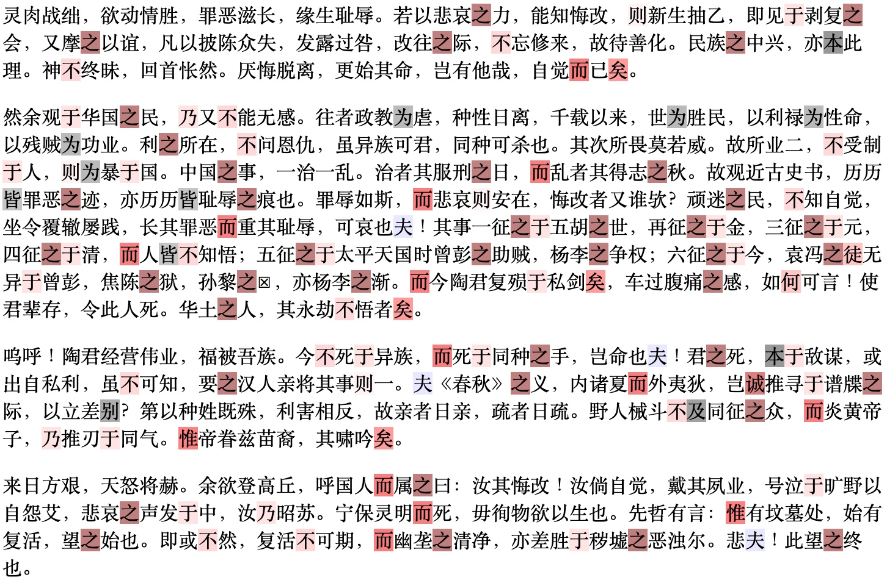

# The Many Voices

[](https://codeberg.org/haining/the_many_voices/src/branch/main/README.md)
[](https://codeberg.org/haining/the_many_voices/src/branch/main/README.zh.md)

This repository hosts the corpus and scripts for reproducing the findings of *The Many Voices of Du Ying: Revisiting 
the Disputed Writings of Lu Xun and Zhou Zuoren*.

We found that *Looking at the Country of China* (shown in the image below) was written by Lu Xun rather than 
Zhou Zuoren, among other findings. Please refer to our [manuscript](https://arxiv.org/abs/2310.01440) for details.


## Tutorial

We provide Colab notebooks for reproducing the results:
- [Main Experiment](https://colab.research.google.com/drive/1gYdugVvy_4R2IU3J1oASK5BgV3EiB9Gb?usp=sharing), which 
includes feature engineering, classifier building, as well as interpreting and visualizing the findings.
- [Feature Selection](https://colab.research.google.com/drive/1ryNXKcRrnvPEs61udXisuaHi2bEMbCWQ?usp=sharing), 
which involves selecting the most effective and parsimonious feature set for distinguishing authorship and examining the
correlation of the features.

Note that, the notebooks are for pedagogical purposes. See rigorous reproduction in [Reproduction](#reproduction).

## Reproduction

```python3.10
python3.10 -m venv .venv
source .venv/bin/activate
python -m pip install -r requirements.txt
python -m run
```


## Corpus

| Split      | Title                                                                      | Author/Pseudonym     |
|------------|----------------------------------------------------------------------------|----------------------|
| Train      | Lessons from the History of Science (科学史教篇)                                | Lu Xun               |
|            | On the Aberrant Development of Culture (文化偏至论)                             | Lu Xun               |
|            | Preface to Midst the Wild Carpathians (《匈奴奇士录》序)                           | Zhou Zuoren          |
|            | Preface to Charcoal Drawing (《炭画》序)                                        | Zhou Zuoren          |
|            | Preface to The Lost History of Red Star (《红星佚史》序)                          | Zhou Zuoren          |
|            | Preface to The Yellow Rose (《黄蔷薇》序)                                        | Zhou Zuoren          |
|            | A Brief Discussion on Fairy Tales (童话略论)                                   | Zhou Zuoren          |
|            | A Study on Fairy Tales (童话研究)                                              | Zhou Zuoren          |
| Validation | On Radium (说鈤)                                                               | Lu Xun               |
|            | On the Power of Mara Poetry (摩罗诗力说)                                        | Lu Xun               |
|            | Preface to Qiucao Garden Diary (《秋草园日记》序)                                  | Zhou Zuoren          |
|            | An Addendum to Yisi Diary (乙巳日记附记一则)                                       | Zhou Zuoren          |
|            | A Glimpse of Jiangnan Examinees (江南考先生之一斑)                                 | Zhou Zuoren          |
|            | Plight and Broil in a Steamboat (汽船之窘况及苦热)                                 | Zhou Zuoren          |
|            | Looking at the Land of Yue (望越篇)                                           | Zhou Zuoren & Lu Xun |
| Test       | Looking at the Country of China (望华国篇)                                     | Du Ying              |
|            | People of Yue, Forget Not Your Ancestors' Instructions (尔越人毋忘先民之训)         | Du                   |
|            | Where Has the Character of the Republic Gone? (民国之征何在)                     | Du                   |

You can find the English translation of the test samples in the folder [translation](https://codeberg.org/haining/the_many_voices/src/branch/main/translation).

## Visualization



Take *Looking at the Country of China* as an example. Reddish characters are features favoring Lu Xun as the author, 
while the gray ones support the possibility of Zhou Zuoren being the author. The darker the shade, the higher the 
absolute value of the weights associated with each feature. We can see that Lu Xun-favoring features are spread all 
over. Indeed, *Looking at the Country of China* is predicted to have been written by Lu Xun with a probability
of 0.984.

Check more visualization in the folder 
[visualization](https://codeberg.org/haining/the_many_voices/src/branch/main/visualization).

## License

The corpus is designated to the public domain. All other materials are licensed under 0BSD.

## Citation

```tex
@misc{xie2023voices,
      title={The Many Voices of {Duying}: Revisiting the Disputed Essays Between {Lu Xun} and {Zhou Zuoren}}, 
      author={Xin Xie and Jiangqiong Li and Haining Wang},
      year={2023},
      eprint={2310.01440},
      archivePrefix={arXiv},
      primaryClass={cs.CL},
      url={https://arxiv.org/pdf/2310.01440.pdf}
}
```

## Contact
- [rwxiexin@shnu.edu.cn](mailto:rwxiexin@shnu.edu.cn) for general questions. 
- [hw56@indiana.edu](mailto:hw56@indiana.edu) for reproduction.

## Acknowledgements

This project is supported by the National Social Science Foundation of China (22CTQ041), and by the Humanities, Arts, 
Science, and Technology Alliance Collaboratory scholarship from the Institute for Digital Arts and Humanities at 
Indiana University Bloomington.
