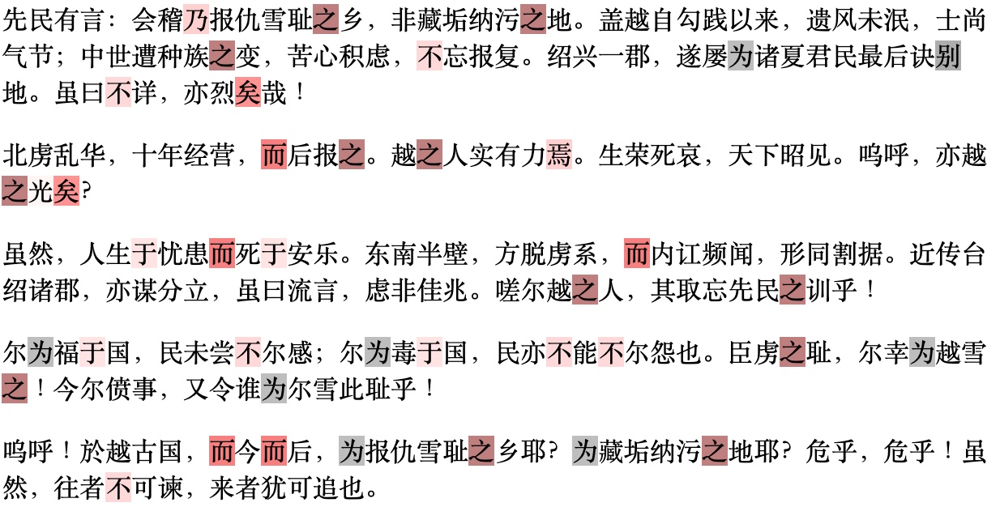

# 独应不独

[](https://codeberg.org/haining/the_many_voices/src/branch/main/README.md)
[](https://codeberg.org/haining/the_many_voices/src/branch/main/README.zh.md)

此仓库存储了复现《独应不独：重新审视有争议的鲁迅和周作人的著作》所需的语料和脚本。

## 教程

我们提供了用于复现结果的Colab笔记。
- [主要实验](https://colab.research.google.com/drive/1gYdugVvy_4R2IU3J1oASK5BgV3EiB9Gb?usp=sharing)，包括数据加载、特征工程、构建分类器、解释和可视化结果。
- [探索性数据分析](https://colab.research.google.com/drive/1ryNXKcRrnvPEs61udXisuaHi2bEMbCWQ?usp=sharing)，包括特征选择和特征关联性的检查。

请注意，这些笔记本仅供教学使用。参见[复现](#reproduction)进行严谨的复现。

## 复现

```python3.10
python3.10 -m venv .venv
source .venv/bin/activate
python -m pip install -r requirements.txt
python run.py
```

## 语料库

| 划分      | 标题                                                                           | 作者/笔名 |
|------------|-------------------------------------------------------------------------------|-------|
| 训练       | 科学史教篇                                                                        | 鲁迅    |
|            | 文化偏至论                                                                        | 鲁迅    |
|            | 《匈奴奇士录》序                                                                     | 周作人   |
|            | 《炭画》序                                                                        | 周作人   |
|            | 《红星佚史》序                                                                      | 周作人   |
|            | 《黄蔷薇》序                                                                       | 周作人   |
|            | 童话略论                                                                         | 周作人   |
|            | 童话研究                                                                         | 周作人   |
| 验证       | 说鈤                                                                             | 鲁迅    |
|            | 摩罗诗力说                                                                        | 鲁迅    |
|            | 《秋草园日记》序                                                                     | 周作人   |
|            | 乙巳日记附记一则                                                                     | 周作人   |
|            | 江南考先生之一斑                                                                     | 周作人   |
|            | 汽船之窘况及苦热                                                                     | 周作人   |
| 测试       | 望越篇                                                                          | 独应    |
|            | 望华国篇                                                                         | 独应    |
|            | 尔越人毋忘先民之训                                                                    | 独     |
|            | 民国之征何在                                                                       | 独     |

## Visualization



以《尔越人毋忘先民之训》为例，偏红的字符是支持鲁迅为作者的特征，而灰色的字符则支持周作人可能为作者。颜色越深，与每个特征相关的权重的绝对值就越高。


## 许可证

语料库已进入公共领域。所有其他材料均根据0BSD许可证授权。

[//]: # (## 引用)

[//]: # (待处理)

[//]: # ()
[//]: # (## 演示)

[//]: # (待处理)

## 联系方式
- [rwxiexin@shnu.edu.cn](mailto:rwxiexin@shnu.edu.cn) 一般性问题咨询。
- [hw56@indiana.edu](mailto:hw56@indiana.edu) 复现相关问题咨询。

## 鸣谢

该项目得到了中国社科基金青年项目（22CTQ041）的支持。