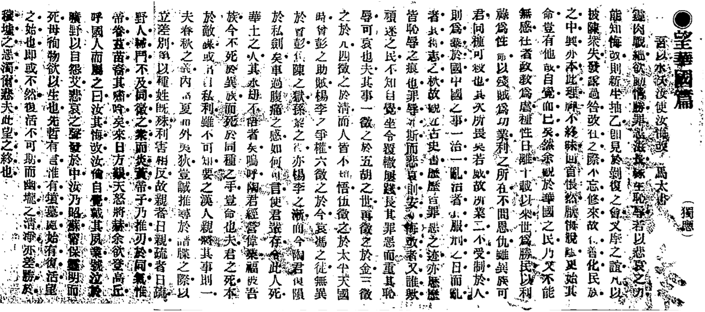

# 独应不独

[](https://codeberg.org/haining/the_many_voices/src/branch/main/README.md)
[](https://codeberg.org/haining/the_many_voices/src/branch/main/README.zh.md)

此仓库存储了复现《独应不独：重新审视有争议的鲁迅和周作人的著作》所需的语料和脚本。


我们发现《望华国篇》（下图）是由鲁迅所写，而非周作人，这只是我们的发现之一。请参考我们的[论文](https://arxiv.org/abs/2310.01440)以获取详细信息。



## 教程

我们提供了Colab笔记本以复现结果：
- [主实验](https://colab.research.google.com/drive/1gYdugVvy_4R2IU3J1oASK5BgV3EiB9Gb?usp=sharing)，包括特征工程，构建分类器，
以及解释和可视化文章的发现。
- [特征选择](https://colab.research.google.com/drive/1ryNXKcRrnvPEs61udXisuaHi2bEMbCWQ?usp=sharing)，涉及到选择最有效且简洁的
用于区分作者身份的特征集，并检查特征的相关性。

请注意，这些笔记本主要是为了教学目的。请查看[复现](#reproduction)中的严谨复现方法。

## 复现

```python3.10
python3.10 -m venv .venv
source .venv/bin/activate
python -m pip install -r requirements.txt
python -m run
```

## 语料库

| 划分 | 标题                                                                           | 作者/笔名  |
|----|-------------------------------------------------------------------------------|--------|
| 训练 | 科学史教篇                                                                        | 鲁迅     |
|    | 文化偏至论                                                                        | 鲁迅     |
|    | 《匈奴奇士录》序                                                                     | 周作人    |
|    | 《炭画》序                                                                        | 周作人    |
|    | 《红星佚史》序                                                                      | 周作人    |
|    | 《黄蔷薇》序                                                                       | 周作人    |
|    | 童话略论                                                                         | 周作人    |
|    | 童话研究                                                                         | 周作人    |
| 验证 | 说鈤                                                                             | 鲁迅     |
|    | 摩罗诗力说                                                                        | 鲁迅     |
|    | 《秋草园日记》序                                                                     | 周作人    |
|    | 乙巳日记附记一则                                                                     | 周作人    |
|    | 江南考先生之一斑                                                                     | 周作人    |
|    | 汽船之窘况及苦热                                                                     | 周作人    |
|    | 望越篇                                                                          | 周作人和鲁迅 |
| 测试 | 望华国篇                                                                         | 独应     |
|    | 尔越人毋忘先民之训                                                                    | 独      |
|    | 民国之征何在                                                                       | 独      |

测试集的英文翻译在[translation](https://codeberg.org/haining/the_many_voices/src/branch/main/translation)文件夹中。

## Visualization


以望华国篇为例。红色的字符是支持鲁迅为作者的特征，而灰色的字符则支持周作人可能是作者的观点。颜色越深，与每个特征相关的权重的绝对值越高。
我们可以看到，支持鲁迅的特征遍布整篇文章。事实上，望华国篇被预测为鲁迅所写的概率为0.984。

前往文件夹 
[visualization](https://codeberg.org/haining/the_many_voices/src/branch/main/visualization)查看更多.


## 许可证

语料库已进入公共领域。所有其他材料均根据0BSD许可证授权。

## 引用

```tex
@misc{xie2023voices,
      title={The Many Voices of {Duying}: Revisiting the Disputed Essays Between {Lu Xun} and {Zhou Zuoren}}, 
      author={Xin Xie and Jiangqiong Li and Haining Wang},
      year={2023},
      eprint={2310.01440},
      archivePrefix={arXiv},
      primaryClass={cs.CL},
      url={https://arxiv.org/pdf/2310.01440.pdf}
}
```

## 联系方式
- [rwxiexin@shnu.edu.cn](mailto:rwxiexin@shnu.edu.cn) 一般性问题咨询。
- [hw56@indiana.edu](mailto:hw56@indiana.edu) 复现相关问题咨询。

## 鸣谢

该这个项目得到了中国国家社会科学基金（22CTQ041）的支持，以及印第安纳大学布卢明顿校区的数字艺术和人文研究所的人文，艺术，科学和技术联盟实验室奖学金的支持。
